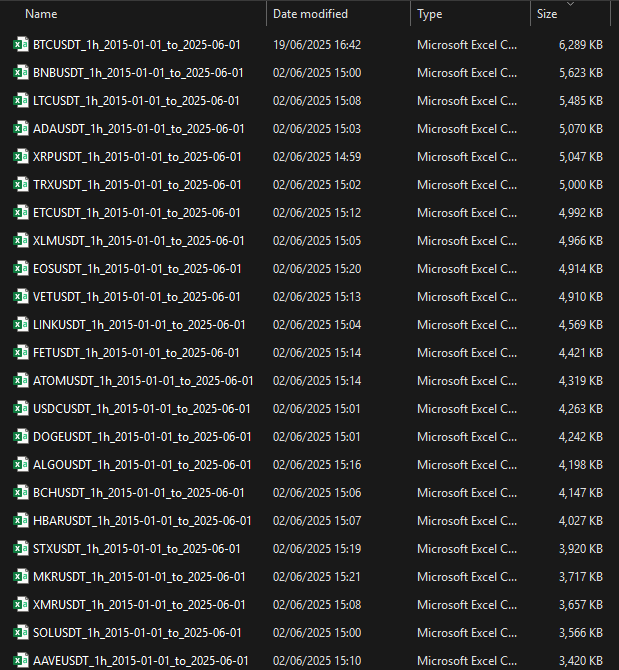
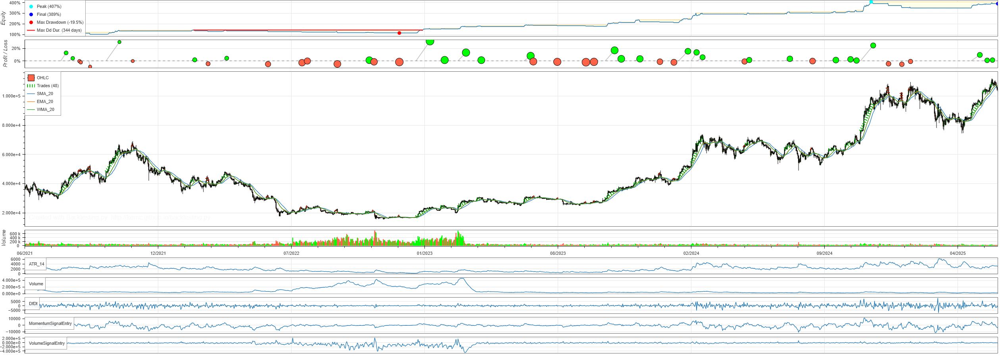
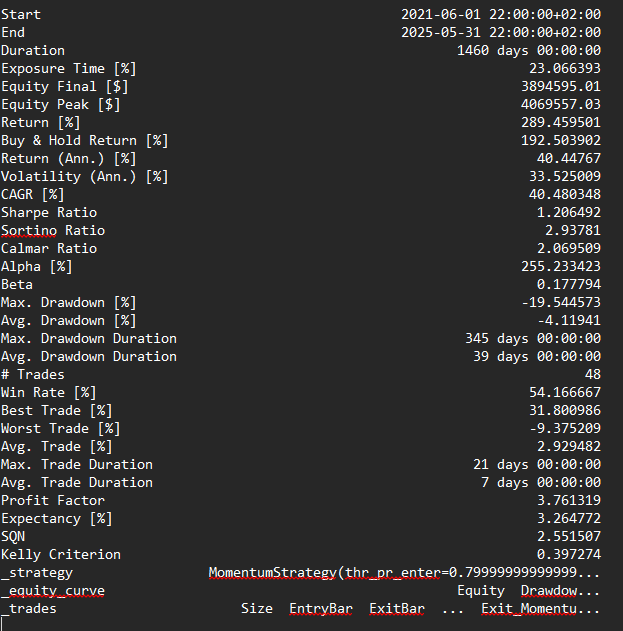
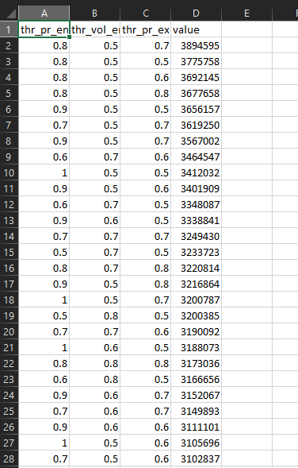
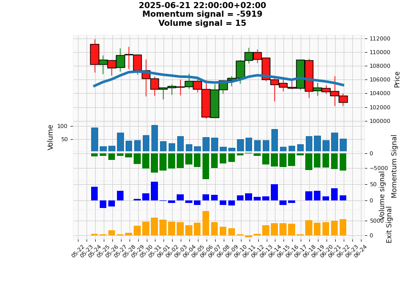

# algo_trading
**Scripts for algorithmic trading**
Scripts for automated data fetching, data transformation, strategy development, backtesting, optimization, visualization and trading signal creation

**Overview:**
**1 fetch_csv_binance.py:** Create local .csv files of financial data in pandas dataframe style to be used for offline data analysis.
- Uses binance API
- Automatically select most traded cyrptocurreny assets
- Convenient filenaming
- Convenient for pandas dataframe and creating candlestick data (OHLCV)

**2 main_backtest_CET.py:** Takes .csv input data and strategy('s) and leverages backtesting.py library for backtesting and optimization
- Takes local .csv data and Tranforms UTC data to CET data
- User defined Custom strategy and indicator implementation
- Visual representation of backtest results including Equity Curve, Drawdown visualization, Position visualization, and other custom representations (leveraging backtesting.py)
- Statistical representation including Sharpe Ratio's and other stats (leveraging backtesting.py)
- Full control on parameter optimization and heatmap visualization (leveraging backtesting.py)

**dashboard.py:** Fetches live data from broker runs indicator/signal operations shows daily dashboard with trading decision
- Flexible broker switching (leveraging cctx library)
- Creates customized dashboard plots using mplfinance library showing processed data
- Can be run daily for buy/hold/sell decision making in trading

  
**fetch_custom_CET.py**: custom python module to fetch live data from given broker and transform from usual UTC timezone to CET timezone.

**quantindicators.py**: custom python module for calling custom quantitive indicitors and signals.

